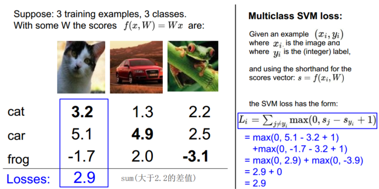
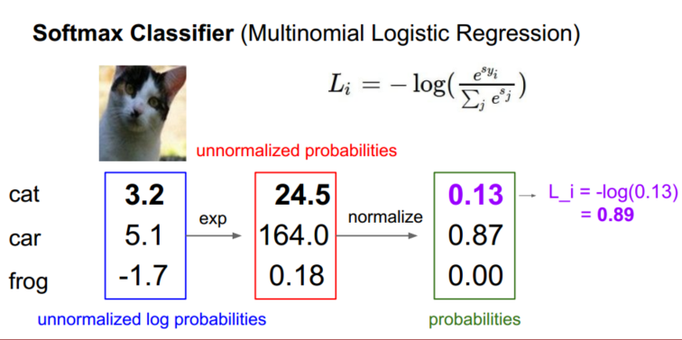
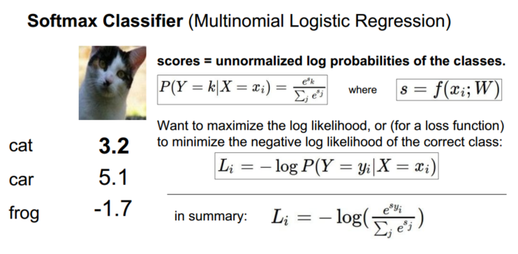

> 查看公式请安装插件[GitHub with MathJax](https://chrome.google.com/webstore/detail/github-with-mathjax/ioemnmodlmafdkllaclgeombjnmnbima)

<!-- TOC -->

- [线性分类器](#线性分类器)
- [SVM的损失函数（折叶损失）](#svm的损失函数折叶损失)
- [Softmax的损失函数（交叉熵损失）](#softmax的损失函数交叉熵损失)
- [正则化](#正则化)
- [最优化](#最优化)
- [小结](#小结)

<!-- /TOC -->

### 线性分类器
简介：针对图像分类，线性分类器比KNN分类器更加强大，并可以自然地延伸到神经网络和卷积神经网络上。这种方法主要有两部分组成：一个是评分函数（score function），它是原始图像数据到类别分值的映射。另一个是损失函数（loss function），它是用来量化预测分类标签的得分与真实标签之间一致性的。

评分函数：$f(x_i,W,b)=Wx_i+b$，即将原始图像像素线性映射到分类分值，参数W被称为权重（weights），b被称为偏差向量（bias vector）

理解：
* 将图像看做高维度的点，每个线性分类器拟合对应样本的分布，再根据得分划分类别界线

* 将线性分类器看做模板匹配，权重W的每一行对应着一个分类的模板

损失函数：使用损失函数（Loss Function）（有时也叫代价函数Cost Function或目标函数Objective）来衡量我们对结果的不满意程度。直观地讲，当评分函数输出结果与真实结果之间差异越大，损失函数输出越大，反之越小。损失函数的具体形式多种多样。

### SVM的损失函数（折叶损失）
想要分类器在正确分类上的得分始终比不正确分类上的得分高出一个边界值$\Delta$（$\Delta$为超参数）。
方程如下：
$$L_i=\sum_{j \neq y_i}max(0,s_j-s_{y_i}+\Delta)$$

计算过程：

直观理解：

多类SVM"想要"正确类别的分类分数比其他不正确分类类别的分数要高，而且至少高出$\delta$的边界值。如果其他分类分数进入了红色的区域，甚至更高，那么就开始计算损失。如果没有这些情况，损失值为0。目标是找到一些权重，它们既能够让训练集中的数据样例满足这些限制，也能让总的损失值尽可能地低。
### Softmax的损失函数（交叉熵损失）
在Softmax分类器中，函数映射$f(x_i;W)=Wx_i$保持不变，但将这些评分值视为每个分类的未归一化的对数概率，并且将折叶损失（hinge loss）替换为交叉熵损失（cross-entropy loss）
方程如下：
$$ Li=-log(\frac{e^{f_{y_i}}}{\sum_j e^{f_j}}) $$

计算例子：

理解：

信息论视角：
最小化在估计分类概率分布（就是上面的$e^{f_{y_i}}/\sum_je^{f_j}$）和"真实"概率（$p=[0,...1,...,0]$中在$y_i$的位置就有一个单独的1）分布之间的交叉熵

概率论视角：
最小化正确分类的负对数概率，这可以看做是在进行最大似然估计（MLE）,而损失函数中的正则化部分R(W)可以被看做是权重矩阵W的高斯先验，进行的是最大后验估计（MAP）而不是最大似然估计。

### 正则化

假设有一个数据集和一个权重集W能够正确地分类每个数据（即所有的边界都满足，对于所有的i都有$L_i=0$）,可能有很多相似的W都能正确地分类所有的数据。为了消除模糊性，并取得更好的权重W，向损失函数添加一个正则化惩罚（regularization penalty）$R(W)$部分。
因此，损失函数由两部分组成：数据损失（data loss），即所有样例的的平均损失$L_i$，以及正则化损失（regularization loss）。完整公式如下所示，左边为数据损失，右边为正则化损失（$\lambda$为超参数）：
$$L= \frac{1}{N}\sum_i L_i+\lambda R(W)$$

$R(W)$的选择：

正则化有时能引入优秀的性质，比如$L_2$正则化倾向于更小更分散的权重向量，这就会鼓励分类器最终将所有维度上的特征都用起来。

### 最优化
寻找能使得损失函数值最小化的参数 $W$ 的过程，一般损失函数为凸函数，但是神经网络不是简单的凸函数，而是凹凸不平的复杂地形，无法使用求极值等最优化技巧。正确的策略是跟随损失函数的梯度，更新参数 $W$ ，逐步趋近最小值。

计算梯度有两种方法：一个是缓慢的近似方法（数值梯度法），但实现相对简单。另一个方法（分析梯度法）计算迅速，结果精确，但是实现时容易出错，且需要使用微分。一般使用分析梯度法，辅以数值梯度法检查。

利用有限差值计算梯度：

根据$\frac{df(x)}{dx}= \lim_{h \to 0} \frac{f(x+h)-f(x)}{h}$或者$\lim_{h \to 0}\frac{f(x+h)-f(x-h)}{2h}$计算偏导数，而梯度就是在每个维度上偏导数所形成的向量。

微分分析计算梯度：

对损失函数进行微分，求出$\nabla_{w_j}L_i$，用SVM的损失函数在某个数据点上的计算来举例：

$$L_i=\sum_{j \neq y_i}[max(0,w^T_j x_i-w^T_{y_i}x_i+\Delta)]$$

对$w_{y_i}$进行微分得到：

$$\nabla_{w_{y_i}}L_i=-(\sum_{j \neq y_i}1(w^T_j x_i-w^T_{y_i} x_i+\Delta>0))x_i$$

对复杂的函数直接计算梯度不是容易的事，在神经网络中使用链式法则来高效地计算梯度，也就是通常所说的反向传播（backpropagation）机制。

小批量数据梯度下降：利用训练集中的小批量（batches）数据计算$L_i$再得到梯度，小批量数据的梯度就是对整个数据集梯度的一个近似。

推荐阅读[从线性模型到神经网络](http://simtalk.cn/2016/08/23/%E4%BB%8E%E7%BA%BF%E6%80%A7%E6%A8%A1%E5%9E%8B%E5%88%B0%E7%A5%9E%E7%BB%8F%E7%BD%91%E7%BB%9C/)
### 小结

数据集中的(x,y)是给定的。权重从一个随机数字开始，且可以改变。在前向传播时，评分函数计算出类别的分类评分并存储在向量f中。损失函数包含两个部分：数据损失和正则化损失。其中，数据损失计算的是分类评分f和实际标签y之间的差异，正则化损失只是一个关于权重的函数。在梯度下降过程中，我们计算权重的梯度（如果愿意的话，也可以计算数据上的梯度），然后使用它们来实现参数的更新。