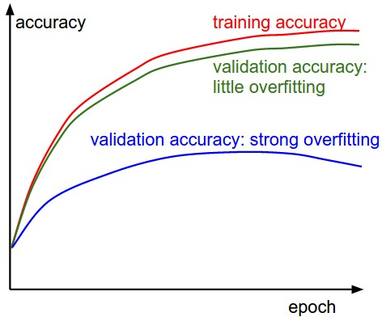
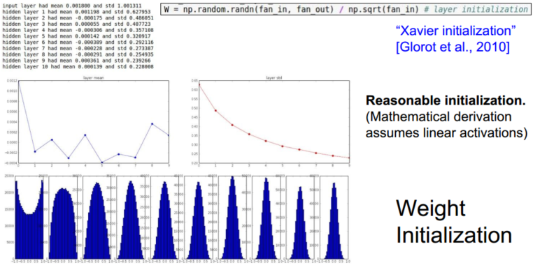

> 查看公式请安装插件[GitHub with MathJax](https://chrome.google.com/webstore/detail/github-with-mathjax/ioemnmodlmafdkllaclgeombjnmnbima)

<!-- TOC -->

- [梯度检查](#梯度检查)
    - [使用相对误差来比较](#使用相对误差来比较)
        - [使用双精度进行梯度检查](#使用双精度进行梯度检查)
        - [保持在浮点数有效的范围](#保持在浮点数有效的范围)
    - [目标函数的不可导点](#目标函数的不可导点)
        - [使用少量数据点](#使用少量数据点)
    - [谨慎设置步长h](#谨慎设置步长h)
    - [在特定的训练阶段进行梯度检查](#在特定的训练阶段进行梯度检查)
    - [不要让正则化损失掩盖数据损失](#不要让正则化损失掩盖数据损失)
    - [记得关闭随机失活（dropout）和数据扩张（augmentation）](#记得关闭随机失活dropout和数据扩张augmentation)
    - [检查少量的维度](#检查少量的维度)
- [训练前：合理性（Sanity）检查](#训练前合理性sanity检查)
    - [确定特定的正确损失值](#确定特定的正确损失值)
    - [提高正则化强度时导致损失值变大](#提高正则化强度时导致损失值变大)
    - [对小数据子集过拟合](#对小数据子集过拟合)
- [训练中：跟踪多个重要数值](#训练中跟踪多个重要数值)
    - [损失函数](#损失函数)
    - [训练集与验证集准确率](#训练集与验证集准确率)
    - [权重更新比例](#权重更新比例)
    - [每层的激活数据与梯度分布](#每层的激活数据与梯度分布)
    - [可视化卷积核](#可视化卷积核)

<!-- /TOC -->
### 梯度检查
理论上将进行梯度检查很简单，就是简单地把解析梯度和数值计算梯度进行比较, 但是在实际过程中十分复杂, 下面是一些注意事项:
首先应使用中心化公式，其中h是一个很小的数字，在实践中近似为1e-5
$$\frac{df(x)}{dx}=\frac{f(x+h)-f(x-h)}{2h}$$

#### 使用相对误差来比较
相对误差>1e-2：通常就意味着梯度可能出错；1e-2>相对误差>1e-4：有点担忧；1e-4>相对误差：这个值的相对误差对于有不可导点的目标函数是OK的；1e-7或者更小：好结果。此外，网络的深度越深，相对误差就越高。
$$ \frac{|f'_a-f'_n|}{max(|f'_a|,|f'_n|)}$$

##### 使用双精度进行梯度检查
单精度浮点数来进行梯度检查会使得相对误差值很高（比如1e-2），主要是由于数值计算问题。

##### 保持在浮点数有效的范围
梯度过小会导致更多的数值问题，建议把原始的解析梯度和数值梯度数据打印出来，确保用来比较的数字的值不是过小（通常绝对值小于1e-10就绝对让人担心）。。如果确实过小，可以使用一个常数暂时将损失函数的数值范围扩展到一个更"好"的范围，在这个范围中浮点数变得更加致密。比较理想的是1.0的数量级上，即当浮点数指数为0时。

#### 目标函数的不可导点
不可导点是指目标函数不可导的部分，由ReLUReLU等函数，或SVM损失，Maxout神经元等引入的, 当x=−1e6时，对ReLU函数进行梯度检查。因为x<0时，解析梯度在该点的梯度为0, 然而在这里数值梯度计算出一个非零的梯度值，因为可能越过了不可导点导致了一个非零的结果。

##### 使用少量数据点
含有不可导点的损失函数(使用了ReLU或者边缘损失)的数据点越少，不可导点就越少，所以在计算有限差值近似时越过不可导点的几率就越小, 如果你的梯度检查对2-3个数据点都有效，那么基本上对整个批量数据进行梯度检查也是没问题的。

#### 谨慎设置步长h
在实践中h并不是越小越好，因为当h特别小的时候，就可能就会遇到数值精度问题。有时候如果梯度检查无法进行，可以试试将h调到1e-4或者1e-6，然后突然梯度检查可能就恢复正常。

#### 在特定的训练阶段进行梯度检查
梯度检查是在参数空间中的一个随机的特定点进行的。导致两个缺点：即使是在该点上梯度检查成功了，也不能马上确保全局上梯度的实现都是正确的；一个随机的初始化可能不是参数空间最优代表性的点。最好让网络学习（"预热"）一小段时间，等到损失函数开始下降的之后再进行梯度检查。

#### 不要让正则化损失掩盖数据损失
正则化损失可能吞没掉数据损失，在这种情况下梯度主要正则化部分决定, 这样就掩盖了数据部分的梯度导致无法判定数据损失部分的梯度的正确性, 所以先关掉正则化对数据损失做单独检查，然后对正则化做单独检查。

#### 记得关闭随机失活（dropout）和数据扩张（augmentation）
进行梯度检查时，记得关闭网络中任何不确定的效果的操作，比如随机失活，随机数据扩展等，不然它们会在计算数值梯度的时候导致巨大误差。关闭这些操作不好的一点是无法对它们进行梯度检查, 例如随机失活的反向传播实现可能有错误, 更好的解决方案就是在计算$f(x+h)$和$f(x−h)$前强制增加一个特定的随机种子，在计算解析梯度时也同样如此。

#### 检查少量的维度
在实际中，梯度可以有上百万的参数，在这种情况下只能检查其中一些维度然后假设其他维度是正确的。
注意：确认在所有不同的参数中都抽取一部分来梯度检查，有时候可能偏置项只占整个参数的一小部分，随机抽样会导致偏置项参数检查缺失，在我看来可以采用分层抽样。

### 训练前：合理性（Sanity）检查
#### 确定特定的正确损失值
在使用小参数进行初始化时，确保得到的损失值与预想的期望一致, 让正则化强度为0, 单独检查数据损失。
1. 如基于数据集CIFAR-10的Softmax分类器，一般期望它的初始损失值是2.302。这是因为初始时预计每个类别(共10类)的概率是0.1，对应Softmax损失值正确分类的负对数概率：-ln(0.1)=2.302
2. 对于Weston Watkins SVM，假设所有的边界都被越过（因为所有的分值都近似为零），所以损失值是9（因为对于每个错误分类，边界值是1）。
#### 提高正则化强度时导致损失值变大
#### 对小数据子集过拟合
在整个数据集进行训练之前，尝试在一个很小的数据集上进行训练（比如20个数据），确保能到达0的损失值。最好让正则化强度为0，不然不会得到0损失, 只有通过这一个正常性检查才能进行整个数据集训练。

### 训练中：跟踪多个重要数值
可视化重要数值是观察训练进程的一扇窗口，是直观理解不同的超参数设置效果的工具，从而知道如何修改超参数以获得更高效的学习过程。

注意：在图表中，x轴通常都是表示周期（epochs）单位，该单位衡量了在训练中每个样本数据都被观察过次数的期望, 一个周期意味着每个样本数据都被观察过了一次, 也就是这批数据对于模型的一次完整的训练。相较于迭代次数（iterations），一般更倾向跟踪周期，这是因为迭代次数与数据的批尺寸（batchsize）有关，而批尺寸的设置又可以是任意的。
#### 损失函数

过低的学习率会导致模型的改进几乎是线性的, 即模型优化的比较慢;过高的学习率会使得损失值下降很快, 但是最终的损失值却相对较高; 更高的学习率就会导致损失值上升, 因为导致了参数随机震荡；合适的学习率会使得损失值以一个比较恰当的速度下降, 最终的损失值也相对较低；损失值的震荡程度和批尺寸（batch size）有关，当批尺寸为1，震荡会相对较大, 当批尺寸就是整个数据集时震荡就会最小
#### 训练集与验证集准确率

在训练集准确率和验证集准确率中间的空隙指明了模型过拟合的程度：空隙过大说明模型过拟合，应该增大正则化强度, 更多的随机失活等方法或者收集更多的数据；空隙过小说明模型欠拟合, 应该增大参数数量使得模型更加复杂一些

#### 权重更新比例
权重中更新值的数量和全部权重的数量之间的比例, 需要对每个参数集的更新比例进行单独的计算和跟踪, 一个经验性的结论是这个比例应该在1e-3左右, 如果更低，说明学习率可能太小，如果更高，说明学习率可能太高。

#### 每层的激活数据与梯度分布

为了更好地初始化权重，观察输出网络中所有层的激活数据柱状图可以推出梯度分布，任何奇怪的分布都不是好兆头。比如对于使用tanh的神经元，我们应该看到激活数据的值在整个[-1,1]区间中都有分布。如果看到神经元的输出全部是0，或者全都饱和了往-1和1上跑，那肯定就是有问题了。

#### 可视化卷积核

将神经网络第一层的权重可视化，只适用于第一层，左图中的特征充满了噪音：网络没有收敛，学习率设置不恰当，正则化惩罚的权重过低。右图的特征不错，平滑，干净而且种类繁多，说明训练过程进行良好。

区分[可视化特征图与可视化权重](http://blog.csdn.net/zb1165048017/article/details/52643188)（卷积核），一个卷积核提取图像的一个特征图，此处只是简单地可视化第一层卷积核权重以检查网络，在后面还会学习到更多有效的可视化方式。