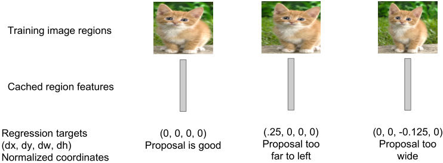
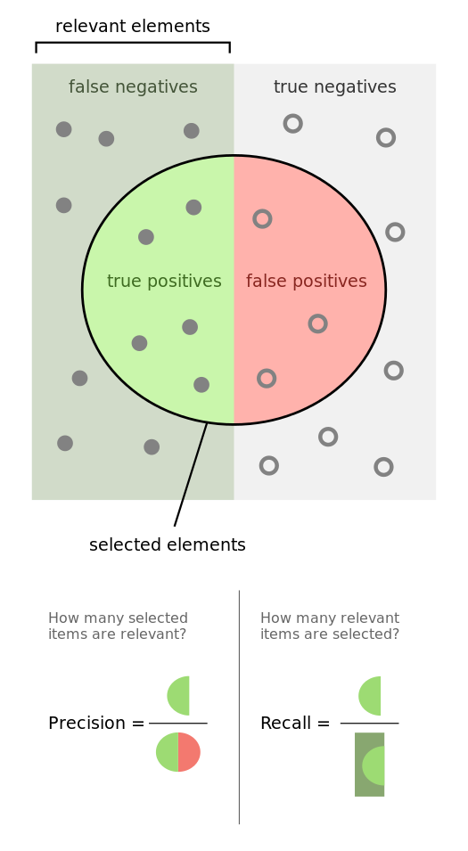
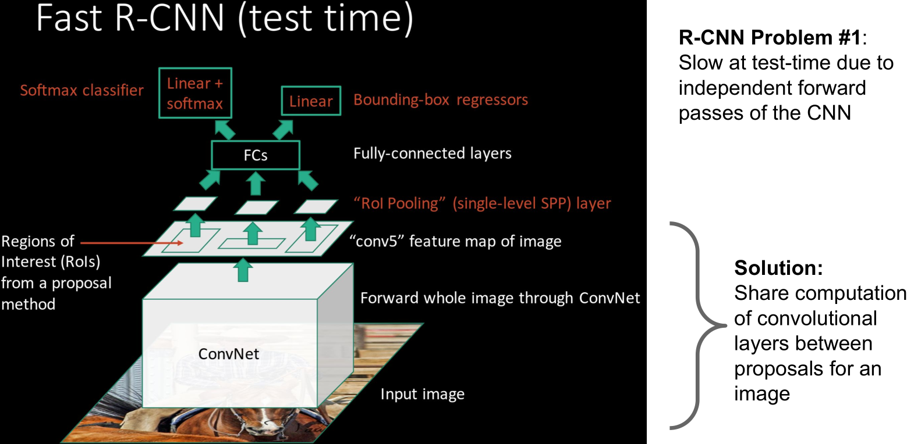
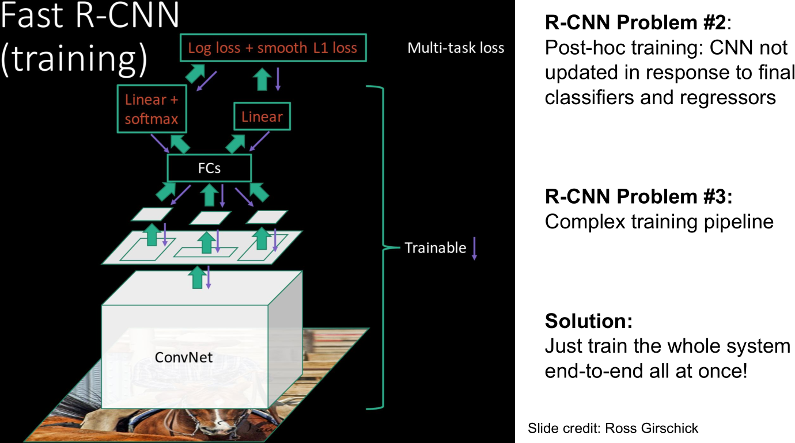
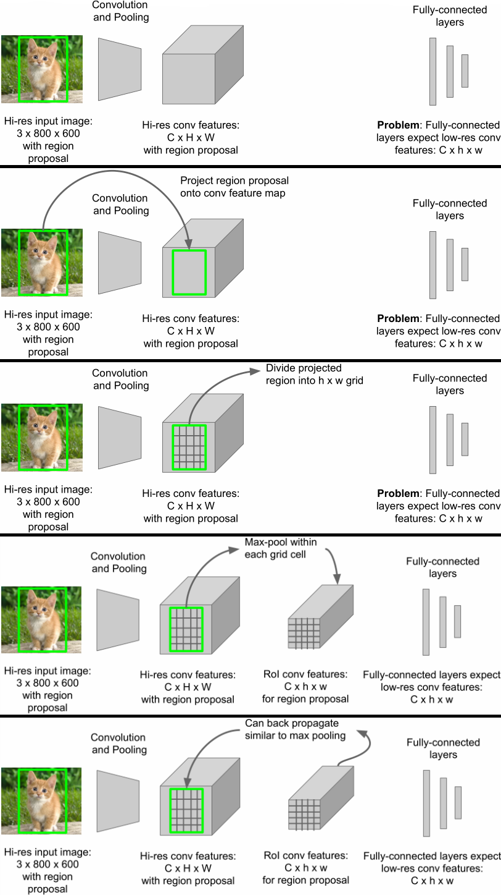
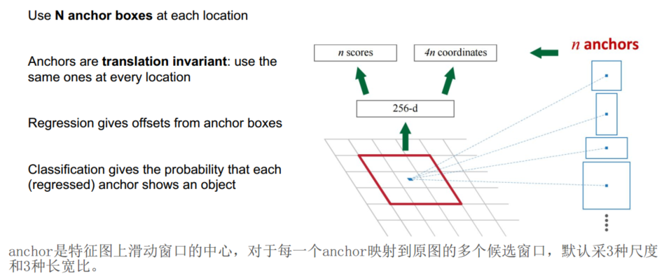
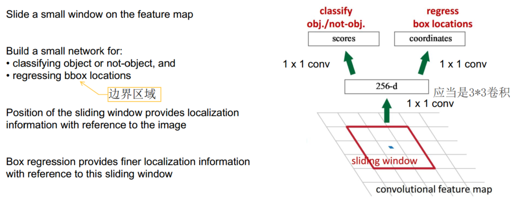
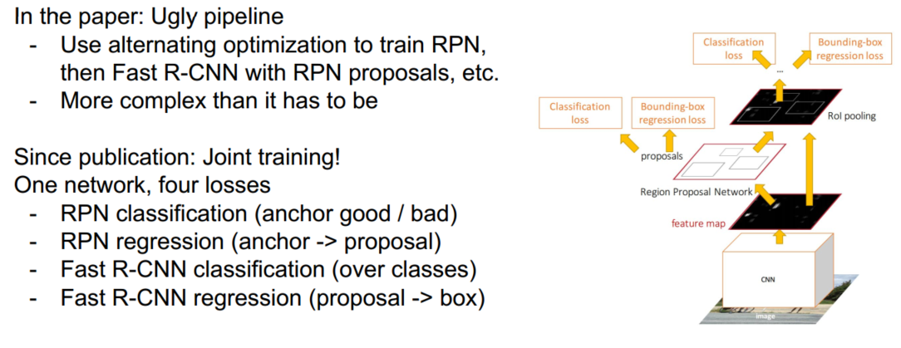
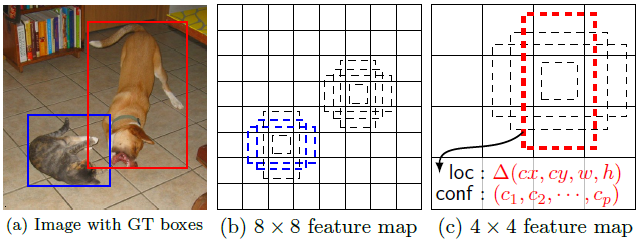

> 查看公式请安装插件[GitHub with MathJax](https://chrome.google.com/webstore/detail/github-with-mathjax/ioemnmodlmafdkllaclgeombjnmnbima)
<!-- TOC -->

- [CV的基本任务](#cv的基本任务)
- [分类+定位](#分类定位)
    - [用回归来做定位](#用回归来做定位)
    - [滑动窗口](#滑动窗口)
- [目标检测](#目标检测)
    - [传统方式](#传统方式)
    - [Region Proposals](#region-proposals)
    - [R-CNN](#r-cnn)
        - [训练流程](#训练流程)
        - [性能评估](#性能评估)
        - [缺点](#缺点)
    - [Fast R-CNN](#fast-r-cnn)
    - [Faster R-CNN](#faster-r-cnn)
        - [RPN](#rpn)
        - [训练](#训练)
    - [YOLO](#yolo)
    - [SSD](#ssd)
- [总结](#总结)

<!-- /TOC -->

### CV的基本任务
分类：单类别

定位：单类别 + 单类别矩形框

检测：两个类别（目标与背景） + 目标矩形框

识别：多类别 + 每个类别矩形框

分割：多类别 + 每个类别像素集

注意：本课程没有仔细区分检测和识别。

### 分类+定位

#### 用回归来做定位
CNN的数据损失函数包含分类问题和回归问题，经典网络即解决分类问题，将定位看作回归问题，输出位置边框坐标与正确坐标的L2距离作为损失函数。
1.先单独训练一个分类的模型（AlexNet, VGG, GoogLeNet），主要是其用于提取特征的卷积网络部分
2.加上一个新的全连接层“回归输出（regression head）”到网络上
3.使用随机梯度下降和L2损失单独训练回归输出
4.在测试时同时使用两个全连接层完成两个任务：选框定位和分类

在回归中有两种做法：一种是不定类回归，一共只有四个数（一个框），第二种做法是特定类回归，假定我们一共有C类，那么一共有Cx4个数字，即针对每一类都有一个框。在实际应用中，通常会使用的是第二种特定类回归，比如人体姿态检测。

不同网络的回归的输出端是不相同的，Overfeat和VGG是添加在卷积层之后，DeepPose和R-CNN是添加在全连接层之后，根据实际应用需要决定。

#### 滑动窗口
在高分辨率的图片上进行分类和回归，把全连接网络转变成卷积神经网络进行有效计算，在所有的尺度上把分类和回归的结果结合起来做最后的预测，典型代表是Overfeat。
滑动窗口具体工作：使用滑动窗口在整个图像滑动，得到多个输入再计算出多个分类得分和多个回归边界框，只要选择的分最好的那个边界框作为最后的边界框输出。在实际的应用中，还会在其中添加尺度变换，当然也会添加不同尺寸的滑动窗口，增加准确度。

为了提高计算的效率，把在最后的全连接层替换为卷积层

近几年成果：

### 目标检测
物体检测任务中目标数量不定，使用回归的方法已不再适合；将检测看作分类，需要测试多个位置和尺寸，如果分类器够快可以挨个位置尝试；使用的分类器计算量非常大比如CNN，使用Region Proposal方法，处理可能位置集合中极小的子类。注意：虽说检测看成分类问题，但当检测出是一个物体时就涉及定位，又有回归问题，更合理的说法是将检测看成多个定位问题，结合分类和回归两种思想。

#### 传统方式
传统的目标检测一般使用滑动窗口的框架，主要包括三个步骤：
1、利用不同尺寸的滑动窗口框住图中的某一部分作为候选区域，穷举策略。
2、提取候选区域相关的视觉特征。比如人脸检测常用的Harr特征；行人检测和普通目标检测常用的HOG特征等。形态多样性、光照变化多样性、背景多样性使得特征鲁棒性差。
3、利用分类器进行识别，主要有SVM、Adaboost等。
HOG:Histogram of Oriented Gradients（方向梯度直方图）
DPM:Deformable Parts Mode（多尺度形变部件模型）

#### Region Proposals
找出所有可能存在目标对象的区域，提取[候选区域](http://blog.csdn.net/zxdxyz/article/details/46119369)方法汇总：

[Selective Search](http://blog.csdn.net/surgewong/article/details/39316931)：先以像素为单位，把相近的像素进行融合，再转换成对应的边界框。
[Edge Boxes](http://blog.csdn.net/wsj998689aa/article/details/39476551)：用边缘信息（Edge），确定框框内的轮廓个数和与框框边缘重叠的轮廓个数，并基于此对框框进行评分，进一步根据得分的高低顺序确定proposal信息

#### R-CNN

候选区域提取（Selective Search）+特征提取（CNN）+分类（SVM）&定位（Bounding-box Regression）

##### 训练流程
Step1：利用ImageNet数据集训练一个分类模型 (AlexNet)。

Step2：微调（fine-tune）模型用于检测。

- 去掉最后一个全连接层，根据实际类别数量设置全连接层神经元数量，重新初始化。
- 从检测图像中选取正/负样本区域对模型进行训练

Step3：提取特征。

- 从所有图像中提取候选区域
- 对每个区域：缩放到和CNN模型输入尺寸相同大小，进行前向传播，将pool5层特征保存下来留给后续分类器（相当于分隔的fc层）定位和分类

Step4：针对每个类别训练一个二分类SVM来对区域特征进行分类

Step5：边框回归，即针对每一类训练一个线性回归模型，将区域特征映射到边框坐标，对候选框进行调整

##### 性能评估
使用一种称为mAP（mean average precision）的度量标准，对每一类计算相应的精度均值，然后计算在所有类别上的精度均值 。
- 当检测区域与真实值区域的IoU大于某阈值（一般取0.5（mAP@0.5））时检测结果判定为正确 
- 汇总所有测试图像的检测结果，画出每类的准确率/召回率曲线，精度均值就是曲线下方的区域面积，兼顾了准确率和召回率。
- mAP的取值范围为0~100，越高表示性能越好

补充准确率和召回率的知识点，两者是此消彼长的：

##### 缺点
（1）测试阶段运行太慢，因为需要对所有候选区域图像进行CNN前向传播
（2）SVM和回归模型都是事后处理，CNN特征无法根据SVM和回归模型的响应进行更新
（3）训练流程比较复杂
#### Fast R-CNN
简单思想：可以对图像提一次卷积层特征，再将Region Proposal在原图的位置映射到卷积层特征图上，最后把每个Region Proposal的卷积层特征输入到全连接层做后续操作。
1、同一张图像不同候选区域共享卷积层的计算结果

2、对整个系统进行端到端训练

小插曲：每个Region Proposal的尺度不一样，直接这样输入全连接层肯定是不行的，因为全连接层输入必须是固定的长度，有以下两套方案：

SPP-Net：针对不同尺寸输入图片，利用自适应窗口在CNN之后的Feature Map上分割成同样大小的特征图并Pooling，转化成相同尺度的向量。

Region of Interest Pooling(ROI pooling)：SPP-NET的一个精简版，SPP-NET对每个proposal使用了不同大小的金字塔映射，而ROI pooling只需要下采样到一个7x7的特征图。

缺点：Region Proposal的提取是在原图使用selective search再映射到特征层，目标检测时间大多消耗在提取Region Proposal。

#### Faster R-CNN
引入RPN(Region Proposal Networks)网络，加快目标检测速度和提高目标检测的性能。即使用卷积神经网络直接产生Region Proposal，不需要外部的候选区域。
##### RPN
本质是滑动窗口，RPN只需在最后的卷积层上滑动一遍，因为Anchor机制和边框回归可以得到多尺度多长宽比的Region Proposal。

滑动窗口卷积得到高维特征向量，传给两个小网络box-classification layer和box-regression layer，分别用于分类和边框回归（类别只有目标和背景两个类别）

##### 训练
论文中描述的是交替优化RPN及后续处理，比较复杂；实际应用是结合在一起进行训练，一个网络，四个损失：RPN分类（锚点框中是否有物体）、RPN回归（锚点框->候选框）、Fast R-CNN分类（所属类别）、Fast R-CNN回归（候选框->定位框）

#### YOLO
直接在图像的多个位置上回归出这个位置的目标边框以及目标类别（使用全图的特征），不需要提取中间的Region Proposal再找目标，大大加快了检测的速度，使得YOLO可以每秒处理45张图像，但检测精度并不是很高。注意划分网格与滑动窗口不相同，主要是因为划分网格使用全图的特征而滑动窗口只有窗口信息。

过程如下：

将图像划分为S*S个网格，对于每个网格都预测B个边框，包括每个边框是目标的置信度（5个量）以及每个边框区域在多个类别（C个量）上的概率，根据上一步可以预测出$S\times S\times B$个目标窗口共$S\times S\times (B\times 5 +C)$维向量，最后NMS去除冗余窗口即可（NMS，非最大抑制，一种冗余窗口的融合算法）。

#### SSD
Single Shot MultiBox Detector（单次检测）结合YOLO的回归思想以及Faster R-CNN的anchor机制，使用全图各个位置的多尺度区域特征进行回归，既保持了YOLO速度快的特性，也保证了窗口预测的跟Faster R-CNN一样比较精准。

YOLO预测某个位置使用的是全图的特征，SSD预测某个位置使用的是该位置周围的特征，利用Faster R-CNN的anchor机制建立某个位置和其特征的对应关系。回顾anchor机制：滑动窗口在特征图上的中心点，映射原图多个位置框。不同于Faster R-CNN，这个anchor是在多个feature map上（即不同卷积层），这样可以利用多层的特征并且自然的达到多尺度。

### 总结
定位（Localization） 
- 寻找固定数量物体类型 
- 使用L2回归算法将CNN特征映射为边框坐标 
- 比检测更简单 
- Overfeat：回归+高效滑动窗+全连接层->卷积层 
- 更深的网络结构性能更好 

物体检测（Object Detection） 
- 在图像中寻找不定数量的物体
- 在使用CNN之前，一般使用密集多尺寸滑动窗（如HoG，DPM）
- 在后续区域提取时避免使用密集滑动窗
- R-CNN：Selective Search + CNN classification / regression
- Fast R-CNN：交换卷积层提取特征和提取候选区域的顺序
- Faster R-CNN：在CNN网络中进行候选区域提取
- 更深的网络结构性能更好

提高目标检测方法：
R-CNN系列目标检测框架和YOLO目标检测框架提供目标检测的两个基本框架，此外有一系列提高目标检测性能的方法。
- 难分样本挖掘
- 多层特征融合
- 使用上下文信息

附：推荐阅读文章[cs231n学习笔记-CNN-目标检测、定位、分割](http://blog.csdn.net/myarrow/article/details/51878004)、 [卷积神经网络-目标探测](http://www.shuang0420.com/2017/06/20/卷积神经网络-目标探测/)
