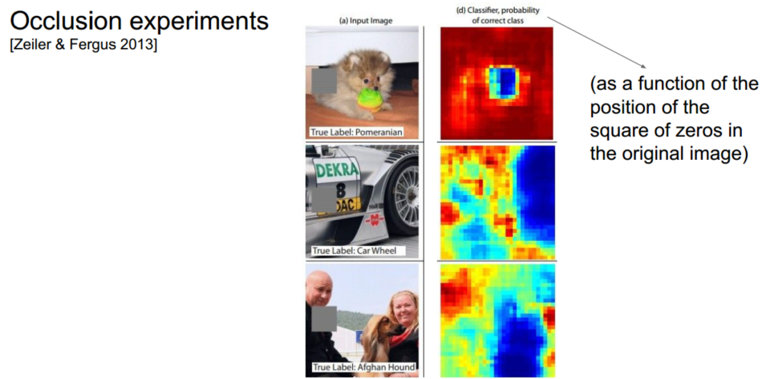

> 查看公式请安装插件[GitHub with MathJax](https://chrome.google.com/webstore/detail/github-with-mathjax/ioemnmodlmafdkllaclgeombjnmnbima)

### 可视化方式
可视化网络不止是直观地可视化权值，还有通过图片数据、特征图等间接可视化卷积核，达到理解卷积网络的目的。

#### 卷积核权值

AlexNet首层卷积层(conv1)的filters是(96,3,11,11)的四维blob,可以得到上述96个11*11的图片块，这些重构出来的图像基本都是关于边缘，条纹以及颜色的信息。

简单地可视化卷积核权值只适用于第一层卷积层，对于后面层的卷积核无法理解其意义。

#### 最大激活神经元的图片块

AlexNet模型较高层(pool5)某个channel具有较强响应的图片块,不失为理解卷积网络的方式。

#### 高维表征

利用t-SNE工具，将许多高维数据输入t-SNE，可以根据数据之间的关系进行聚集，得到直观的表征空间。高维数据一般指卷积网络中后面层的高维特征比如AlexNet全连接层的4096维特征。

#### 遮挡实验
对图片中的某一部分作遮挡处理，然后向卷积神经网络输入遮挡过的图片，统计网络将其分为正确类的可能性

### 可视化

接着看
http://blog.h5min.cn/SPARKKKK/article/details/65937088
https://zhuanlan.zhihu.com/p/24833574
