> 查看公式请安装插件[GitHub with MathJax](https://chrome.google.com/webstore/detail/github-with-mathjax/ioemnmodlmafdkllaclgeombjnmnbima)

<!-- TOC -->

- [关于数据](#关于数据)
    - [数据增强](#数据增强)
    - [迁移学习](#迁移学习)
- [关于卷积](#关于卷积)
    - [卷积结构](#卷积结构)
    - [实现方式](#实现方式)
- [关于实现](#关于实现)
    - [GPU](#gpu)
    - [浮点数精度](#浮点数精度)
- [关于框架](#关于框架)

<!-- /TOC -->

### 关于数据
#### 数据增强

在图片输入CNN之前先做一些变化，改变pixel同时保持图片的label不变，可能减小过拟合的发生。

* Horizontal flips 水平翻转

* Random crops/scales 随机裁剪/缩放图片：
在test的时候要对test set进行固定的裁剪缩放水平翻转等操作，生成至少10张图片，然后输入CNN进行前向传播计算得分的平均值

* Color jitter 颜色变动
最简单的是改变对比度，但不常用；经常是对RGB的pixels采用PCA。

* 平移，旋转，伸长，裁剪等等等

Data augmentation就是在增加训练集防止过拟合，而dropout随机去掉网络的某些部分，还可以向网络加噪声。

#### 迁移学习
做法为：
从网上下载训练好的模型或者在imagenet等数据集训练好的模型，固定前面的网络层用作提取特征，训练后面的网络层用作分类或者微调后面网络结构。

修改fc层适应新的数据集

作用：
解决训练新模型需要大量数据的问题，更快速地训练出有效的网络。

目标数据集和训练数据集的差异大小会导致不同的调整手段：

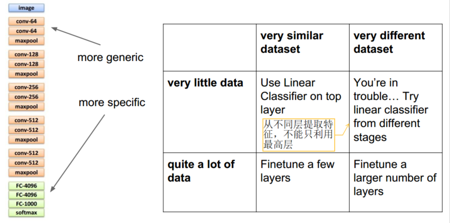

建议：

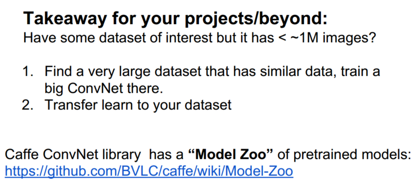

参考文章： [迁移学习技巧以及如何更好的finetune 模型](http://blog.csdn.net/u014381600/article/details/71511794)

### 关于卷积
#### 卷积结构
3个3×3卷积核 VS 1个7×7卷积核

NIN结构：利用1*1卷积核

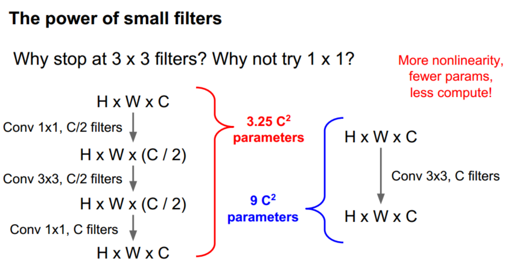

建议：

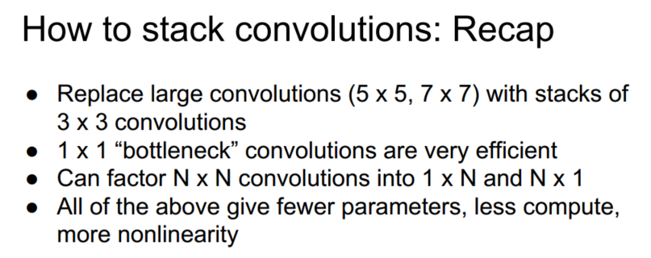

#### 实现方式
im2col转换成矩阵乘法，会耗费大量的内存，因为感受野会有很多重叠的地方，不过这个问题并不是很大

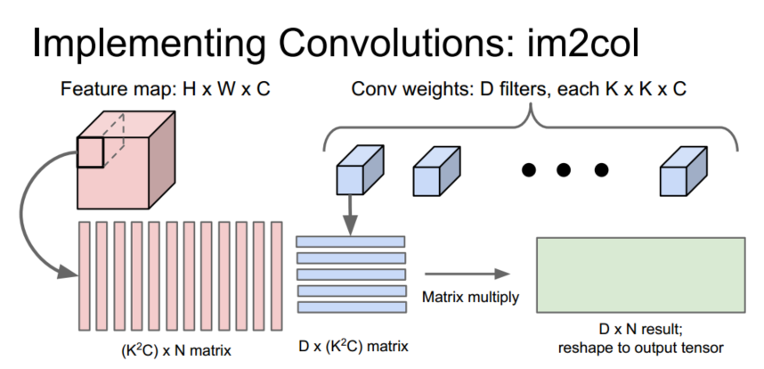

快速傅里叶变换去计算卷积，但FFT只在大滤波器上提升速率明显，在3*3滤波器上提升不是很明显

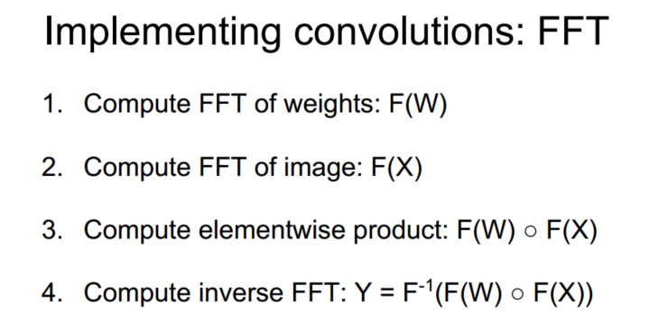

Strassen’s Algorithm：使用更智能的结构减小复杂度，目前只针对3*3卷积核

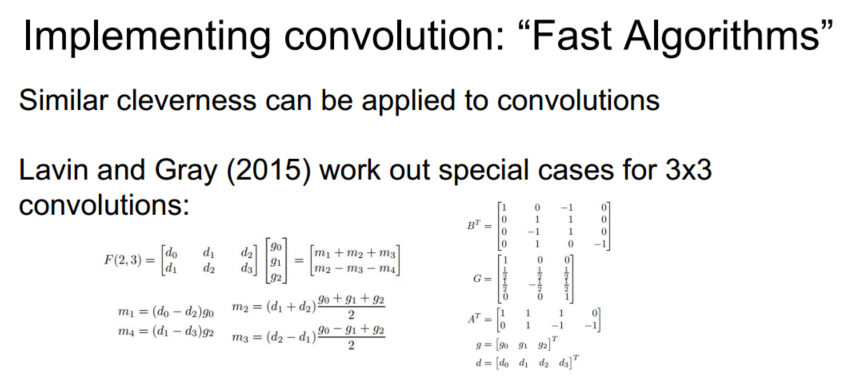

### 关于实现
#### GPU

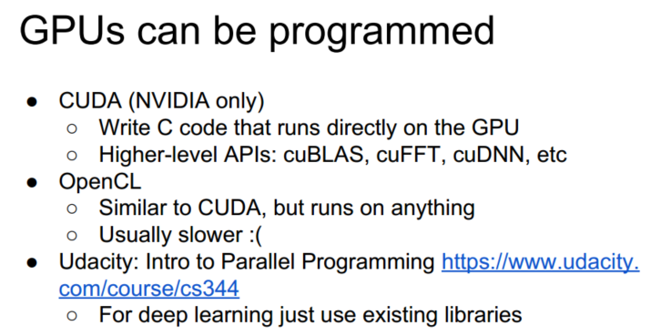

CPU有1~16个高速核心，对串行处理的比较好； GPU有很多个低速核心，对并行处理的比较好，编程语言有cuda和opencl；分布式CPU，参数更新方式分为并行和串行。

瓶颈：

GPU与CPU通信：CPU分为多个线程，一个线程在读取和预处理数据，一个线程在发送数据给GPU。

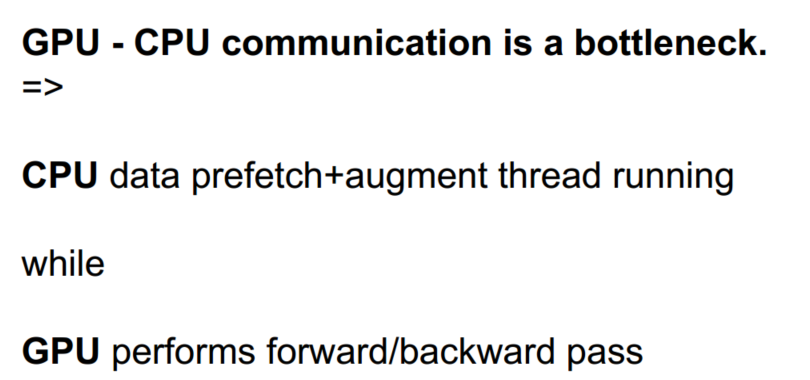

CPU内存限制：将数据转为有序未压缩的字节流，虽然会占用很大空间，但是实际中还是会这样做

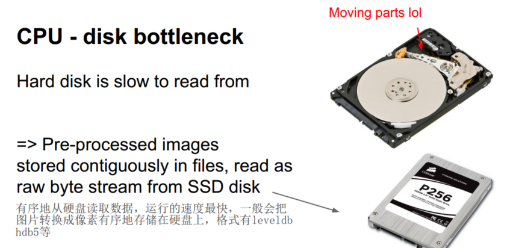

GPU内存限制：暂时没有解决办法

#### 浮点数精度
在深度学习中一般还是用32位浮点数而不是64位，这是为了提高计算速率和可存储的数字的数量。16位浮点数可能会更快，但是更可能会有数值精度问题，有一种技术叫做随机四舍五入使得精度提高，因此逐渐会变为16位。有人试着使用1位数据结构，效果不错，也许将来会成真~

### 关于框架
框架的关键点：
1. 易于建立计算图谱
2. 易于计算梯度
3. 有效地在GPU跑框架（封装cuDNN、cuBLAS）

当前主流框架：

建议：

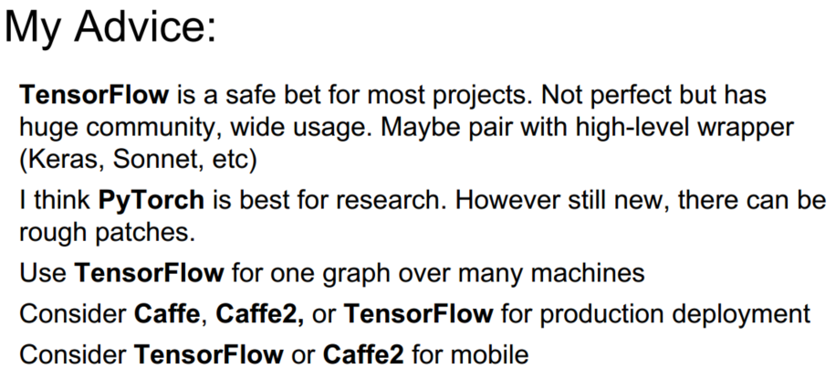
