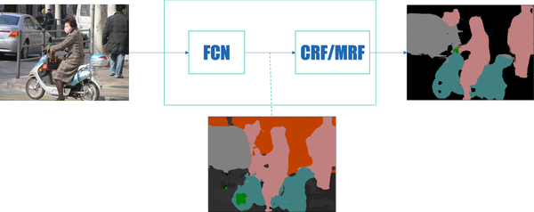
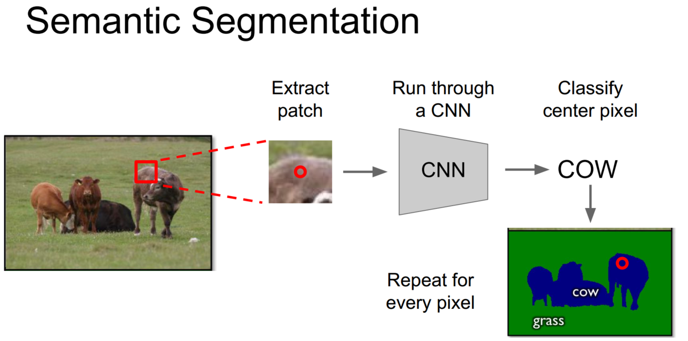
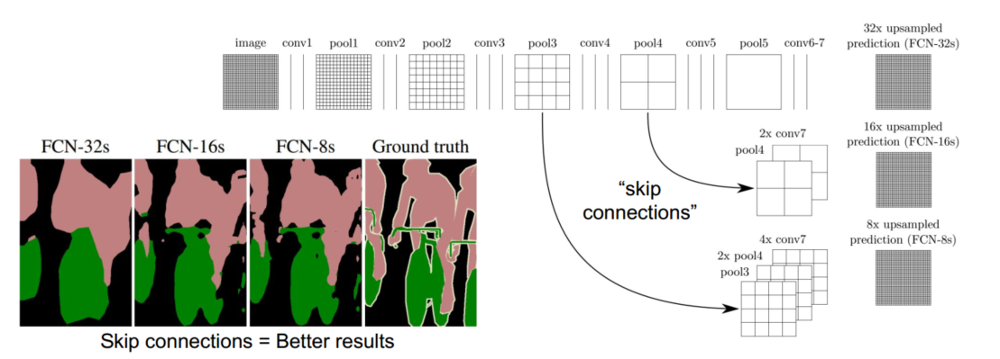
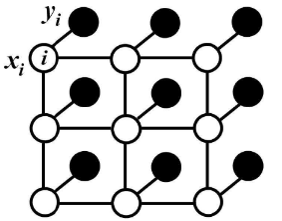
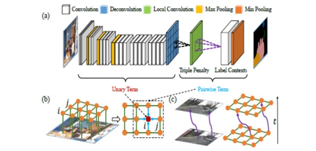

> 查看公式请安装插件[GitHub with MathJax](https://chrome.google.com/webstore/detail/github-with-mathjax/ioemnmodlmafdkllaclgeombjnmnbima)

<!-- TOC -->

- [分割](#分割)
    - [语义分割](#语义分割)
        - [前端](#前端)
        - [后端](#后端)
    - [实例分割](#实例分割)
- [注意力模型](#注意力模型)

<!-- /TOC -->
### 分割
#### 语义分割
给定一张图片,对图片中的每一个像素点进行分类，不区分相同种类的实例，属于经典计算机视觉问题。

通用框架：前端为FCN，后端为随机场（CRF、MRF）,即深度学习+概率图模型（PGM）

##### 前端
传统做法：提取小块图片通过CNN，为每个中心像素分类，反复此类做法

Multi-Scale：使用多尺度图像或者更多信息，并利用传统方法（超像素和分割树）获得图像的自然轮廓

Refinement：在模型能力有限的情况下，多次迭代使得模型考虑到更大的感受野，不断优化之前的决策

Upsampling：将高层特征转化原图大小的分割图，需要使用上采样，方式包括传统插值、参数可学习的deconvolution、上池化、带孔卷积等

Skip Layer：将全卷积之后的特征直接上采样得到的结果是很粗糙的，故将不同池化层的特征进行上采样之后来优化输出。

##### 后端
全连接条件随机场(DenseCRF)：
对于每个像素i具有类别标签$x_i$还有对应的观测值$y_i$，这样每个像素点作为节点，像素与像素间的关系作为边，即构成了一个条件随机场。CRFasRNN采用平均场近似的方法，多次迭代优化结果。

马尔科夫随机场(MRF)：
优点是将平均场构造成了CNN；联合训练并且可以one-pass inference，而不用迭代

高斯条件随机场(G-CRF)：
优点是二次能量有明确全局；解线性简便很多

#### 实例分割
给定一张图片，判断目标各个实例，并标记实例像素，相当于同时进行检测和分割，属于近年计算机视觉问题。

类似RCNN的步骤：提取候选区域，一边利用两个CNN对候选区域分类，一边对候选区域掩码进行优化，主要方式为Hypercolumns，即利用多层特征。

Multi-task Network Cascades：利用RPN提取候选区域，训练掩码再训练分类

### 注意力模型
注意力模型会学习注视相应的对象而产生相应的词语，这也符合人体视觉系统，不是将整个图像压缩成静态表示，根据显着的特征动态前进。当图像中有很多混乱时。

推荐阅读文章[图像语义分割之FCN和CRF](https://zhuanlan.zhihu.com/p/22308032)、[多篇用DL做Semantic Segmentation的文章总结](http://blog.csdn.net/u011148330/article/details/49446443)
