> 查看公式请安装插件[GitHub with MathJax](https://chrome.google.com/webstore/detail/github-with-mathjax/ioemnmodlmafdkllaclgeombjnmnbima)
<!-- TOC -->

- [视频应用](#视频应用)
    - [基于特征](#基于特征)
    - [时空CNN](#时空cnn)
    - [长期时空CNN](#长期时空cnn)
    - [总结](#总结)
- [无监督学习](#无监督学习)
    - [自编码](#自编码)
    - [VAE](#vae)
    - [GAN](#gan)

<!-- /TOC -->
### 视频应用
CNN在图像任务比如ImageNet上取得很好的效果，但是在视频相关的任务中还没有太大的进展，简单介绍一些卷积神经网络的知识以及其在视频动作分类中的应用。
#### 基于特征
使用光流法跟踪关键点，在局部坐标系对轨迹提取HOG/HOF/MBH等特征，进而识别视频动作。

#### 时空CNN
Spatio-Temporal ConvNets结合空域和时域的信息，输入一小段视频，而卷积核增多至原来的T倍，T为视频的帧数，相当于3D卷积。

为获取不同时域的信息，视频的提取方式不同

- single frame：就是把一帧帧的图像分别输入到CNN中去，和普通的处理图像的CNN没有区别。
- late fusion：把相聚L的两帧图像分别输入到两个CNN中去，然后在最后一层连接到同一个full connect的softmax层上去。
- early fusion：把连续L帧的图像叠在一起输入到一个CNN中去。
- slow fusion：和上边的CNN的区别在于一个卷积核的输出不是一个二维的图像，而是一个三维的图像。

另一种同时利用时域和空域信息的CNN：单帧图片和多帧光流图，能获得更好的效果

#### 长期时空CNN
当视频中两个的关联动作相隔时间过长，无法一起输入时空CNN提取相关信息，可以使用LSTM/RNN存储长期信息。

一般情况网络结果如下所示：

为平衡和优化整个网络，将RNN融合到CNN，具体是卷积核的输入包括前一层网络和上一个时间网络，RNN结构包括Vanilla RNN、LSTM、GRU等，一般选择GRU。

得到结果：

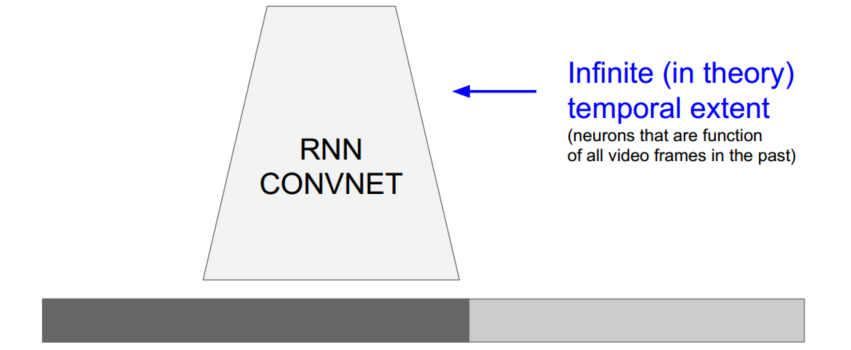

#### 总结

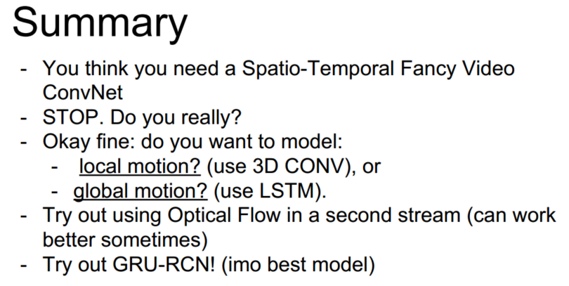

### 无监督学习
监督学习用于学习数据到标签的映射，无监督学习用于学习数据的结构

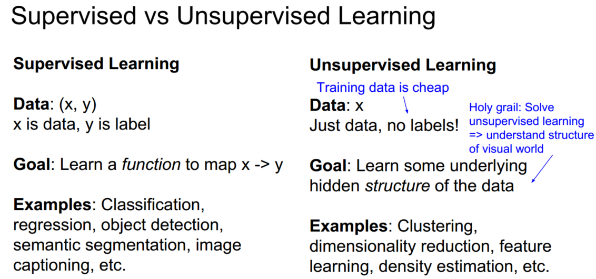

#### 自编码
自动编码器就是一种尽可能复现输入信号的神经网络，为了实现这种复现，自动编码器就必须捕捉可以代表输入数据的最重要的特征。

将译码器换为预测分类器，对编码（即特征）分类，利用少量标签进行监督学习，对网络微调。

自编码器本是独立于神经网络的，有多种衍生形式：

堆叠自编码器：在原编码器的输出特征再次编码，逐层堆叠得到高维有效特征，这也是因为当时由于计算力过弱、无法收敛等原因无法训练过深自编码，而采用堆叠自编码器，目前不再流行。

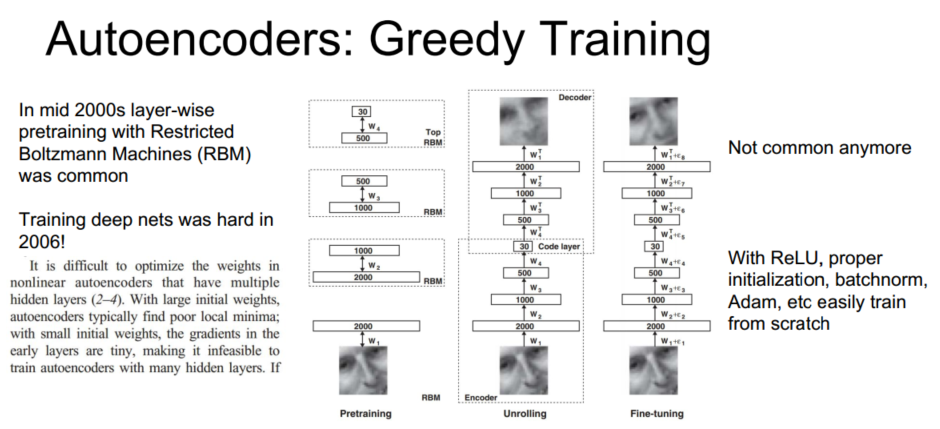

稀疏自编码器：如果隐藏节点比可视节点（输入、输出）少的话，由于被迫的降维，自编码器会自动习得训练样本的特征（变化最大，信息量最多的维度）。但是如果隐藏节点数目过多，甚至比可视节点数目还多的时候，自编码器不仅会丧失这种能力，更可能会习得一种“恒等函数”——直接把输入复制过去作为输出。这时候，我们需要对隐藏节点进行稀疏性限制，可以利用KL散度作为惩罚项。

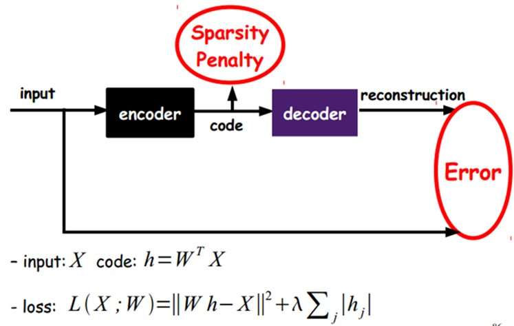

降噪自编码：降噪自动编码器DA是在自动编码器的基础上，训练数据加入噪声，所以自动编码器必须学习去去除这种噪声而获得真正的没有被噪声污染过的输入。因此，这就迫使编码器去学习输入信号的更加鲁棒的表达，这也是它的泛化能力比一般编码器强的原因。DA可以通过梯度下降算法去训练。

#### VAE
VAE（Variational Auto-Encoder，变分自编码器）：利用最大似然或者最大后验概率学习参数

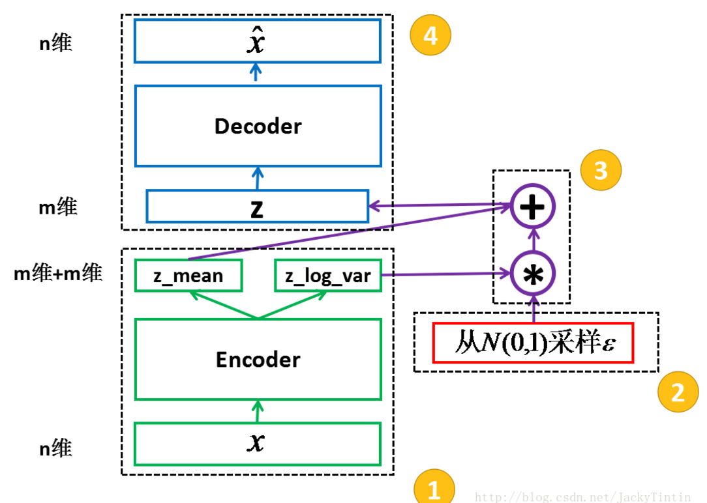

过程：以 n 维原始数据输入训练encoder，得到encoder的输出（2×m 个数）视作分别为 m 个高斯分布的均值（z_mean）和方差的对数（z_log_var），根据 encoder 输出的均值与方差，生成服从相应高斯分布的随机数 z ，作为上面定义的 decoder 的输入，进而产生 n 维的输出$\hat x$。

下图为详细过程：

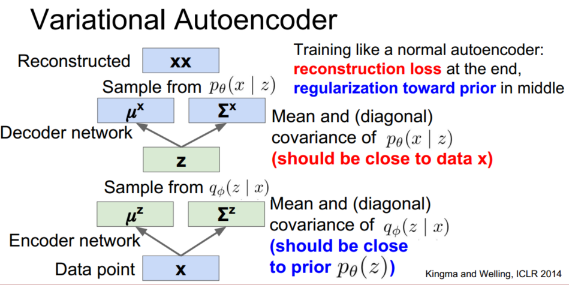

reparemerization 的技巧：由于 $z∼N(μ,σ)$，我们应该从$N(μ,σ)$采样，但这个采样操作对$μ$和$σ$是不可导的，导致常规的通过误差反传的梯度下降法（GD）不能使用。通过 reparemerization，我们首先从$N(0,1)$上采样$ϵ$，然后使得$z=σ⋅ϵ+μ$。这样不仅$z∼N(μ,σ)$，而且从 encoder 输出到 z，只涉及线性操作，（ϵ 对神经网络而言只是常数），因此，可以正常使用 GD 进行优化。

优化目标：令$\hat x$与$x$自身尽量的接近，即$x$经过编码（encode）后，能够通过解码（decode）尽可能多的恢复出原来的信息，可以为交叉熵损失或者均方误差损失，同时对 encoder 的输出$z_mean(μ)$及$z_log_var(log σ^2)$加以约束。但严格而言，按照模型的假设，我们要优化的并不是 x 与 $\hat x$之间的距离，而是要最大化 x 的似然，即使得编码译码参数 θ 最大拟合 x 的分布。

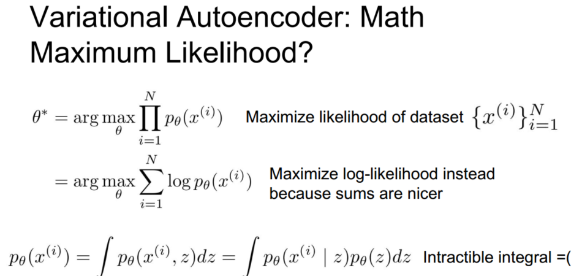

概率论重灾区：通过 MLE 或 MAP 现在我们已经有了要目标（对数似然），但在我们问题下，似然中存在对隐变量 z的积分。合理假设（指定）p(z) 和 p(x|z)的分布形式，可以用期望最大化算法（EM）解决。

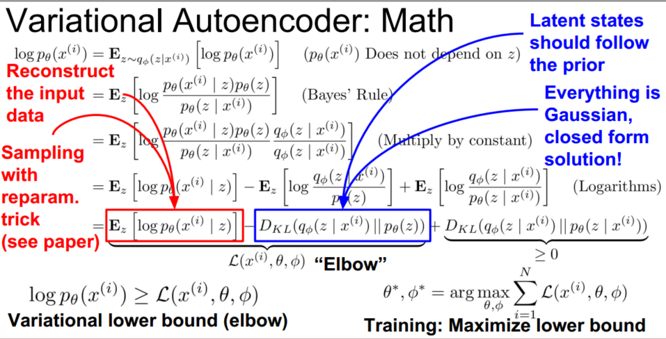

#### GAN
基本思想：判别器要练就“火眼金睛”，尽量区分出真实的样本（如真实的图片）和由生成器生成的假样本；生成器要学着“以假乱真”，生成出使判别器判别为真实的“假样本”。在对抗的过程中，生成器生成样本的分布，应该与训练集样本分布接近。

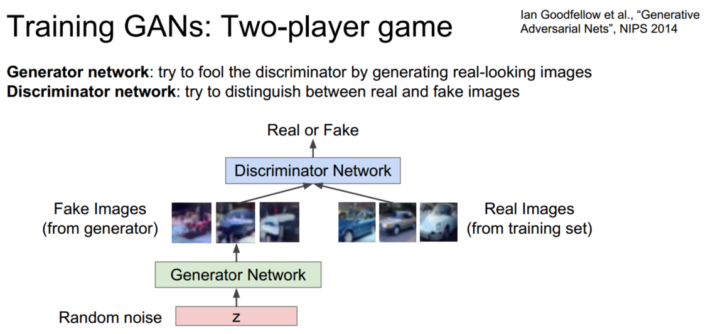

判别器的训练的目标为：对于真实样本，输出尽量接近1；对于生成器生成的假样本，输出尽量接近0。也即训练判别器时，真实样本的标签为1，生成样本的标签为0。

判别器的训练的目标为：生成的假样本，使判别器的输出尽量接近1，即尽量以假乱真。 

算法：

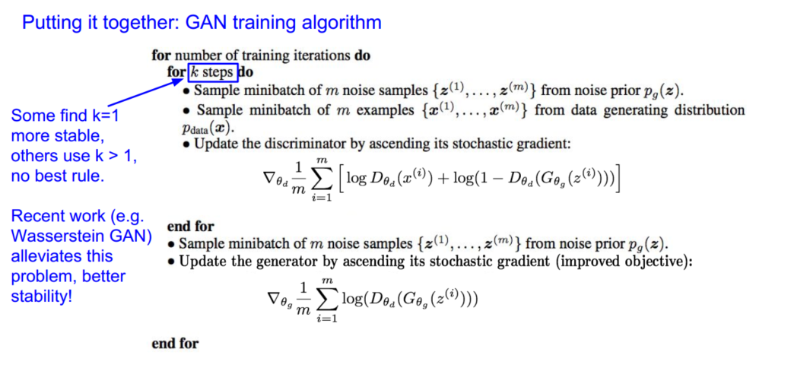

Multi-Scale：不断地进行 downsample 和 upsample 操作，序列化且多尺度进行对抗，同时涉及残差

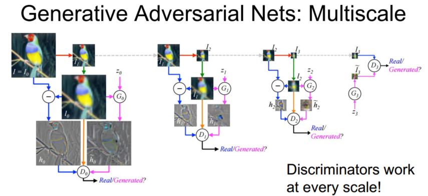

DCGAN：生成器使用上采样全卷积网络判别器使用卷积网络,是目前实用的结构。在潜在空间中用简单运算进行有意义的语义解释，比如用这样一个公式：眼镜男-男+女=眼镜女。

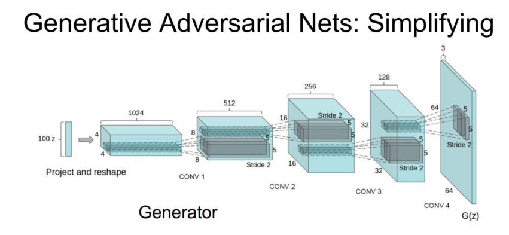

将生成对抗网络和自编码结合，得到更好的数据表和生成数据：

附：推荐阅读文章[视频行为识别年度进展](https://zhuanlan.zhihu.com/p/27415472)、 [AutoEncoder自编码器](http://blog.csdn.net/u010555688/article/details/24438311)、 [VAE变分自编码器](http://blog.csdn.net/jackytintin/article/details/53641885)、 [生成式对抗网络](http://blog.csdn.net/JackyTintin/article/details/61908718)、 [ 生成式对抗网络GAN研究进展](http://blog.csdn.net/solomon1558/article/details/52537114)