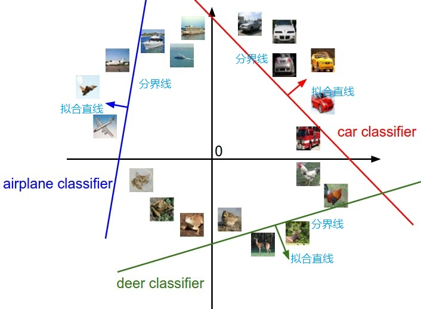

> 查看公式请安装插件[GitHub with MathJax](https://chrome.google.com/webstore/detail/github-with-mathjax/ioemnmodlmafdkllaclgeombjnmnbima)

- [线性分类器](#线性分类器)
- [SVM损失函数（折叶损失）](#svm损失函数（折叶损失）)
- [Softmax分类器](#softmax分类器)
### 线性分类器
简介：针对图像分类，线性分类器比KNN分类器更加强大，并可以自然地延伸到神经网络和卷积神经网络上。这种方法主要有两部分组成：一个是评分函数（score function），它是原始图像数据到类别分值的映射。另一个是损失函数（loss function），它是用来量化预测分类标签的得分与真实标签之间一致性的。

评分函数：$f(x_i,W,b)=Wx_i+b$，即将原始图像像素线性映射到分类分值，参数W被称为权重（weights），b被称为偏差向量（bias vector）

理解：
* 将图像看做高维度的点，线性分类器描述对应的梯度分界线

* 将线性分类器看做模板匹配，权重W的每一行对应着一个分类的模板

损失函数：使用损失函数（Loss Function）（有时也叫代价函数Cost Function或目标函数Objective）来衡量我们对结果的不满意程度。直观地讲，当评分函数输出结果与真实结果之间差异越大，损失函数输出越大，反之越小。损失函数的具体形式多种多样。

### SVM损失函数（折叶损失）
想要分类器在正确分类上的得分始终比不正确分类上的得分高出一个边界值$\Delta$。

方程如下：
$$L_i=\sum_{j \neq y_i}max(0,s_j-s_{y_i}+\Delta)$$
直观理解：

### Softmax分类器

### 正则化

假设有一个数据集和一个权重集W能够正确地分类每个数据（即所有的边界都满足，对于所有的i都有$L_i=0$）,可能有很多相似的W都能正确地分类所有的数据。为了消除模糊性，并取得更好的权重W，向损失函数添加一个正则化惩罚（regularization penalty）$R(W)$部分。
因此，损失函数由两部分组成：数据损失（data loss），即所有样例的的平均损失$L_i$，以及正则化损失（regularization loss）。完整公式如下所示：
$$L= \underbrace{\frac{1}{N}\sum_i L_i}_{data loss}+\underbrace{\lambda R(W)}_{regularization loss}$$