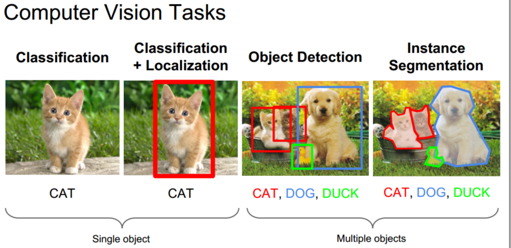
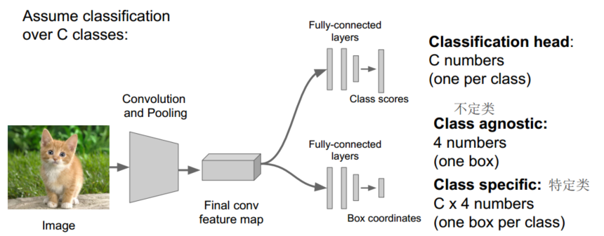
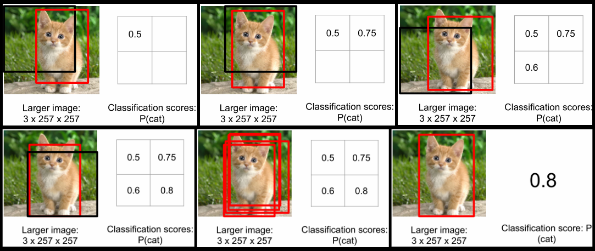
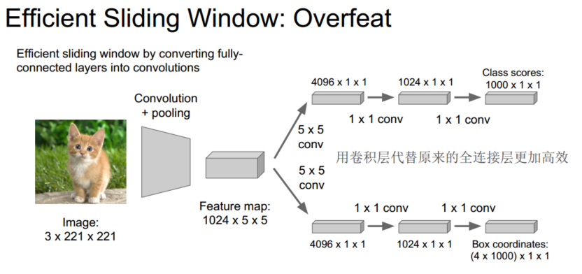
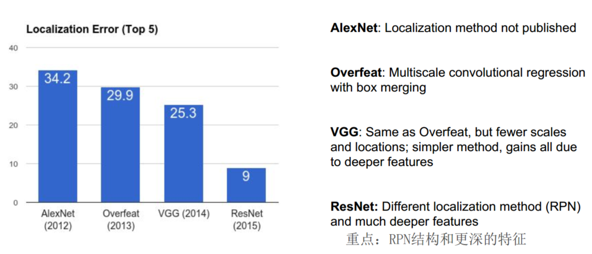

> 查看公式请安装插件[GitHub with MathJax](https://chrome.google.com/webstore/detail/github-with-mathjax/ioemnmodlmafdkllaclgeombjnmnbima)
<!-- TOC -->

- [分类+定位](#分类定位)
    - [用回归来做定位](#用回归来做定位)
    - [滑动窗口](#滑动窗口)
- [目标检测](#目标检测)
    - [传统方式](#传统方式)
    - [Region Proposals](#region-proposals)
    - [R-CNN](#r-cnn)
        - [训练流程：](#训练流程)
        - [性能评估](#性能评估)
        - [缺点](#缺点)
    - [Fast R-CNN](#fast-r-cnn)
    - [Faster R-CNN](#faster-r-cnn)
    - [YOLO](#yolo)
- [总结](#总结)

<!-- /TOC -->

CV的基本任务是图像分类、定位、检测和实例分割

### 分类+定位

#### 用回归来做定位
CNN的数据损失函数包含分类问题和回归问题，经典网络即解决分类问题，将定位看作回归问题，输出位置边框坐标与正确坐标的L2距离作为损失函数。
1.先单独训练一个分类的模型（AlexNet, VGG, GoogLeNet），主要是其用于提取特征的卷积网络部分
2.加上一个新的全连接层“回归输出（regression head）”到网络上
3.使用随机梯度下降和L2损失单独训练回归输出
4.在测试时同时使用两个全连接层完成两个任务：选框定位和分类

在回归中有两种做法：一种是不定类回归，一共只有四个数（一个框），第二种做法是特定类回归，假定我们一共有C类，那么一共有Cx4个数字，即针对每一类都有一个框。在实际应用中，通常会使用的是第二种特定类回归，比如人体姿态检测。

不同网络的回归的输出端是不相同的，Overfeat和VGG是添加在卷积层之后，DeepPose和R-CNN是添加在全连接层之后，根据实际应用需要决定。

#### 滑动窗口
在高分辨率的图片上进行分类和回归，把全连接网络转变成卷积神经网络进行有效计算，在所有的尺度上把分类和回归的结果结合起来做最后的预测，典型代表是Overfeat。注意此处的滑动窗口和检测的候选区域有很大区别。
滑动窗口具体工作：使用滑动窗口在整个图像滑动，计算出多个分类得分和多个回归边界框，只要选择的分最好的那个边界框作为最后的边界框输出。在实际的应用中，还会在其中添加尺度变换，当然也会添加不同尺寸的滑动窗口，增加准确度。

为了提高计算的效率，把在最后的全连接层替换为卷积层

近几年成果：

### 目标检测
物体检测任务中目标数量不定，使用回归的方法已不再适合；将检测看作分类，需要测试多个位置和尺寸，如果分类器够快可以挨个位置尝试；使用的分类器计算量非常大比如CNN，使用Region Proposal方法，处理可能位置集合中极小的子类。
#### 传统方式
传统的目标检测一般使用滑动窗口的框架，主要包括三个步骤：
1、利用不同尺寸的滑动窗口框住图中的某一部分作为候选区域，穷举策略。
2、提取候选区域相关的视觉特征。比如人脸检测常用的Harr特征；行人检测和普通目标检测常用的HOG特征等。形态多样性、光照变化多样性、背景多样性使得特征鲁棒性差。
3、利用分类器进行识别，主要有SVM、Adaboost等。
HOG:Histogram of Oriented Gradients（方向梯度直方图）
DPM:Deformable Parts Mode（多尺度形变部件模型）

#### Region Proposals
找出所有可能存在目标对象的区域，提取[候选区域](http://blog.csdn.net/zxdxyz/article/details/46119369)方法汇总：

[Selective Search](http://blog.csdn.net/surgewong/article/details/39316931)：先以像素为单位，把相近的像素进行融合，再转换成对应的边界框。
[Edge Boxes](http://blog.csdn.net/wsj998689aa/article/details/39476551)：用边缘信息（Edge），确定框框内的轮廓个数和与框框边缘重叠的轮廓个数，并基于此对框框进行评分，进一步根据得分的高低顺序确定proposal信息

#### R-CNN

候选区域提取（Selective Search）+特征提取（CNN）+分类（SVM）&定位（Bounding-box Regression）

##### 训练流程：
Step1：利用ImageNet数据集训练一个分类模型 (AlexNet)

Step2：微调（fine-tune）模型用于检测。

- 去掉最后一个全连接层，根据实际类别数量设置全连接层神经元数量，重新初始化。
- 从检测图像中选取正/负样本区域对模型进行训练

Step3：提取特征。

- 从所有图像中提取候选区域
- 对每个区域：缩放到和CNN模型输入尺寸相同大小，进行前向传播，将pool5层特征保存下来留给后续分类器定位和分类

Step4：针对每个类别训练一个二分类SVM来对区域特征进行分类

Step5：边框回归，即针对每一类训练一个线性回归模型，将区域特征映射到边框坐标，对候选框进行调整

##### 性能评估
使用一种称为mAP（mean average precision）的度量标准，对每一类计算相应的精度均值，然后计算在所有类别上的精度均值 。
- 当检测区域与真实值区域的IoU大于某阈值（一般取0.5（mAP@0.5））时检测结果判定为正确 
- 汇总所有测试图像的检测结果，画出每类的准确率/召回率曲线，精度均值就是曲线下方的区域面积，兼顾了准确率和召回率。
- mAP的取值范围为0~100，越高表示性能越好

补充准确率和召回率的知识点，两者是此消彼长的：

##### 缺点
（1）测试阶段运行太慢，因为需要对所有候选区域图像进行CNN前向传播 
（2）SVM和回归模型都是事后处理，CNN特征无法根据SVM和回归模型的响应进行更新 
（3）训练流程比较复杂
#### Fast R-CNN

#### Faster R-CNN

#### YOLO

### 总结
