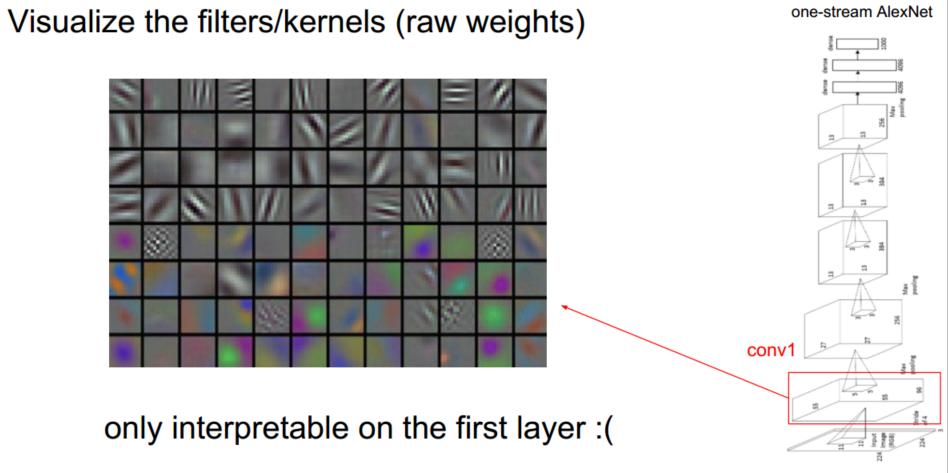
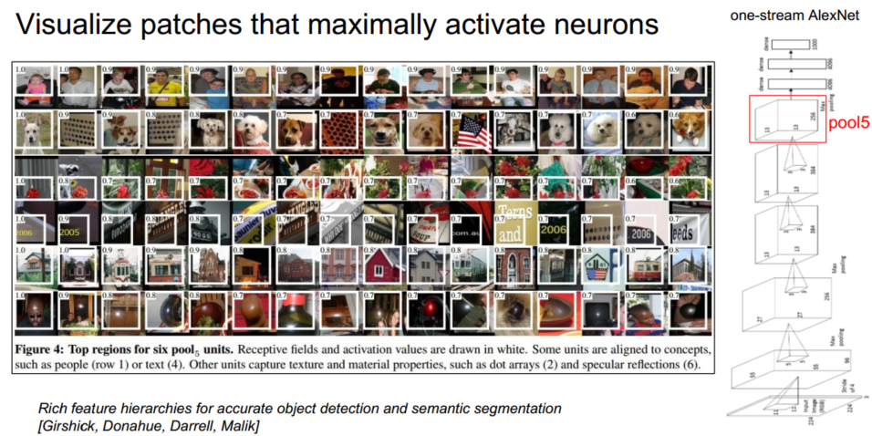
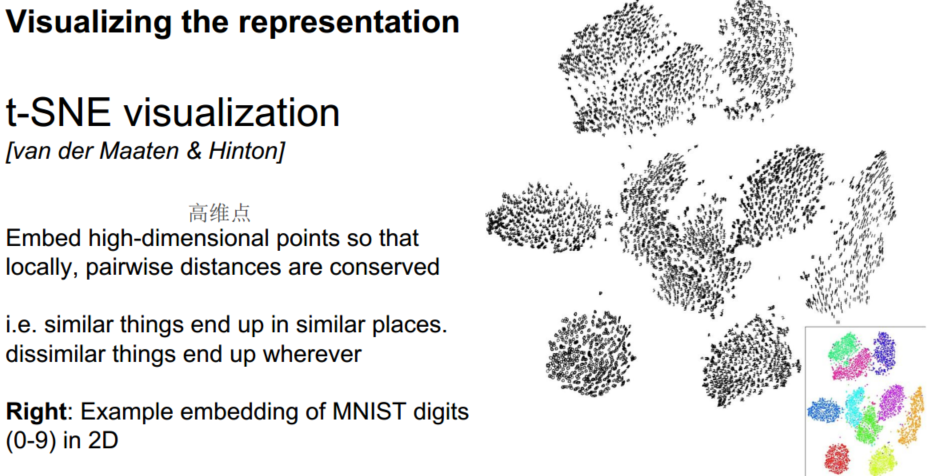
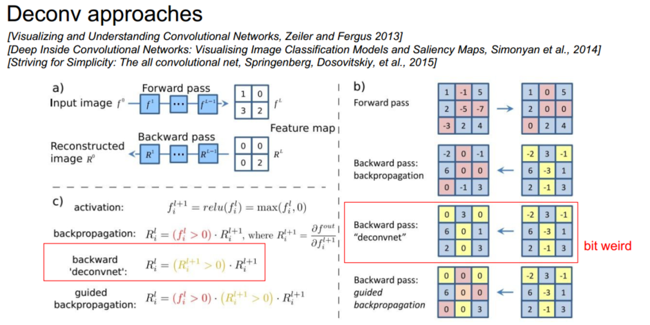
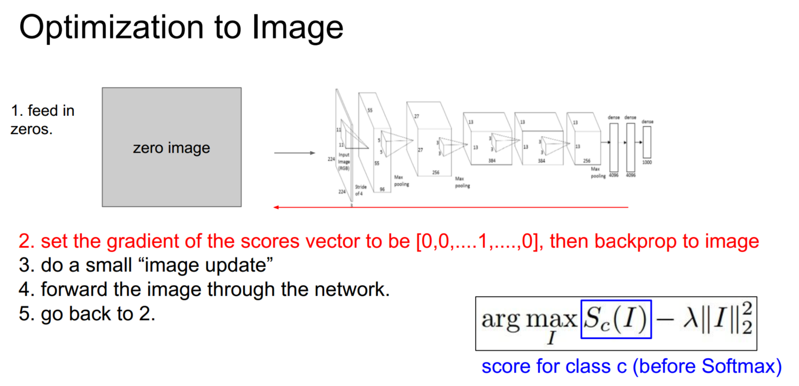
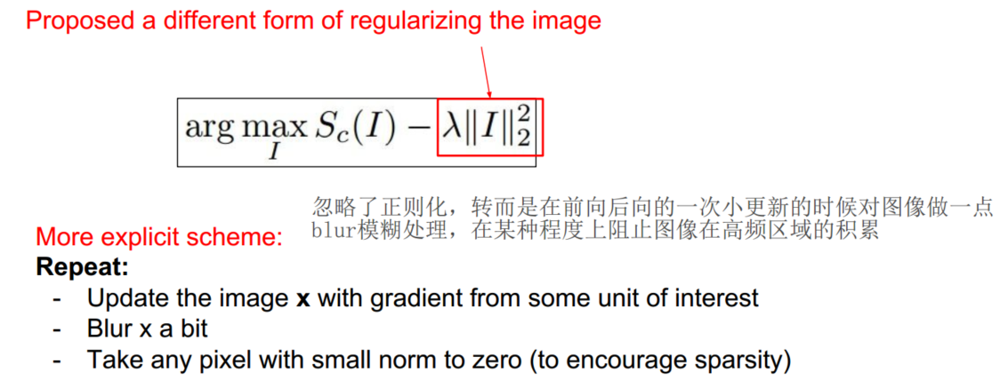

> 查看公式请安装插件[GitHub with MathJax](https://chrome.google.com/webstore/detail/github-with-mathjax/ioemnmodlmafdkllaclgeombjnmnbima)
<!-- TOC -->

- [概述](#概述)
- [卷积核权值](#卷积核权值)
- [最大激活神经元的图片块](#最大激活神经元的图片块)
- [高维表征](#高维表征)
- [遮挡实验](#遮挡实验)
- [去卷积方法](#去卷积方法)
- [图像最优化](#图像最优化)
- [特征反演](#特征反演)
- [对抗样本](#对抗样本)

<!-- /TOC -->
### 概述
为了理解卷积网络，通过各种方式可视化网络特征以及输入关系，其中可视化方式不止是直观地可视化权值，还有通过图片数据、特征图等间接可视化卷积核，最优化图像、特征反演。总的来说，将某些关系映射回输入像素空间，表明了什么样的输入模式将会导致某些结果，即可视化。

### 卷积核权值

AlexNet首层卷积层(conv1)的filters是(96,3,11,11)的四维blob,可以得到上述96个11*11的图片块，这些重构出来的图像基本都是关于边缘，条纹以及颜色的信息。

简单地可视化卷积核权值只适用于第一层卷积层（类似Gabor过滤器），对于后面层的卷积核无法解释其结果，因为每一层的权重都是在前一层输出结果上进行了卷积操作。

### 最大激活神经元的图片块

AlexNet模型较高层(pool5)某个channel具有较强响应的图片块,不失为理解卷积网络的方式。

### 高维表征

利用t-SNE工具（t分布随机邻域嵌入算法），将许多高维数据输入t-SNE，可以根据数据之间的关系进行聚集，得到直观的二维表征空间。高维数据一般指卷积网络顶层的高维特征比如AlexNet全连接层的4096维特征。

### 遮挡实验
对图片中的某一部分作遮挡处理，然后向卷积神经网络输入遮挡过的图片，统计网络将其分为正确类的可能性

### 去卷积方法
求解网络中任意一个神经元对于输入的梯度相当于揭示模型中任意层的feature map与输入之间的响应关系，方法是：前向传播到这层神经元然后停止，再把这一个神经元Gradient设置为1.00(把这层其他神经元Gradient设置为0)，然后再直接从这个神经元进行反向传播，就可以计算得到这个神经元对于输入的梯度。其中反向传播的方式有三种：backpropagation、backward deconv、Guided backpropagation。

backpropagation：普通的反向传播过程，梯度遇到ReLU层时其激活值小于0则阻断，该梯度图片难以解释，但如果把这张图片和原始图片叠加，将会提高对应神经元的激活函数值。

backward deconv：对梯度使用relu函数，使得反卷积每层输出的梯度都是正数，得到的图片算是清晰易懂。

Guided backpropagation：backprop和deconv的结合，不仅把所有不被激活的修正线性单元ReLU关闭，还把所有反向传播时遇到的负信号设置到阈值0。去除了所有负梯度对我们所选的神经元造成的影响，只保留了正面的影响，获得的图片就会更加清晰更容易解释。

以下是反卷积方式可视化的结果，理解为代表该层特征图：

### 图像最优化
保持神经网络架构不变，反复更新一张随机图像以找到一张图像使得某些类别的分数最大化，达到理解（可视化）网络的目的，该技巧可以被应用到神经网络中的所有节点上。

其中$\lambda ||I||^2_2$为正则化项，改进了输出图像的可视化程度。

有另一种正则化图像的形式：

### 特征反演
给定一个卷积神经网络的编码（特征代表，可以理解为是神经网络中某一层的输出值），根据其重构原来图像。步骤如下：
(1) 向网络中传入一些输入图像；
(2) 忽略输入图像；
(3) 在某些层对输入进行反向传播，直到在网络中找到这样的层，能够生成与输入图像相同的「编码」（在这一层学到的特征表示）的图像。

$I$代表一个输入图像，$\phi_l(I)$为卷积神经网络$\phi$中的激活层$l$。我们希望找到一个图像$I^∗$，它与图像$I$在神经网络$\phi$中的$l$层有相似的特征表示，以达到重建的效果（常识可知即使给定相同的CNN code，也可能有不同的重建结果）。

### 对抗样本
是对原有图像加入很小的扰动而构成的图像，可以使得网络的预测结果出现变化。比如把小狗图片沿着鸵鸟类的梯度方向变化一下，就可能会使网络分辨为鸵鸟类 。

理解：
- 神经网络常有很高的维度以及内在的线性本质，随着问题维度的不断增加，对输入图像施加很多小的扰动，这些细微的变化加在一起，最终会对输出造成很大的变化。

- 这是对抗扰动在模型权重向量下高度对齐的结果。一些小的改变迫使该线性模型专注某一个信号，该信号和模型的权重值最相近；即便其它 (从正确图像中得来的) 信号有更大的振幅也是如此。

推荐文章[可视化和理解深度神经网络](https://www.jiqizhixin.com/articles/c8064ef1-7339-4a4e-affa-c07031f04dd7)、[对抗样本与对抗训练](http://blog.h5min.cn/cdpac/article/details/53170940)
